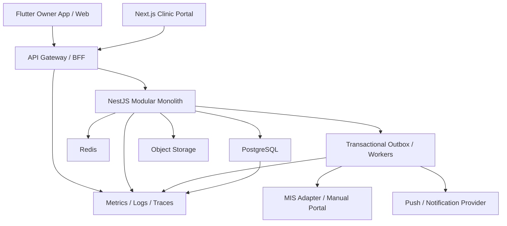

# ЕДИНЫЙ ГЕНЕРАЛЬНЫЙ ПЛАН ДОРАБОТКИ VETHELP
## От текущей реализации и Prototype V50 до Presale & First Installation MVP

**Документ:** Integrated MVP Delivery Master Plan  
**Версия:** 1.0  
**Дата:** 20 июля 2026 года  
**Горизонт:** 18 недель при полной минимальной команде  
**Целевой результат:** крепкий B2B2C MVP для пресейла, демонстраций, подключения первых 1–5 клиник и контролируемого пилота  
**Базовый UX-эталон:** Prototype V50  
**Архитектурный подход:** Modular Monolith, PostgreSQL Source of Truth, Integration Adapters, Transactional Outbox  
**Формат эксплуатации:** облачный multi-tenant SaaS  
**Статус документа:** обязательная программа работ и ограничений

---

# 1. Цель программы

Программа должна привести VetHelp не к «полностью завершенной ветеринарной экосистеме», а к продукту, который можно:

1. убедительно показывать владельцам и руководителям клиник;
2. устанавливать первой клинике без многомесячной интеграции;
3. использовать для реальной записи владельцев;
4. измерять по скорости согласования слота;
5. эксплуатировать без риска двойного бронирования;
6. расширять без переписывания текущего backend;
7. продавать как инструмент привлечения и обработки записей;
8. использовать как основу дальнейшего подключения МИС.

---

# 2. Главная продуктовая формула

# **VetHelp MVP — это не каталог и не полноценная замена МИС.**

Целевой продукт:

```text
владелец сообщает, какая помощь нужна
→ быстро видит подходящие клиники и актуальное время
→ создает заявку
→ клиника подтверждает, отклоняет или предлагает альтернативу
→ владелец всегда понимает текущий статус
→ подтвержденная запись появляется у обеих сторон
→ клиника управляет очередью, расписанием, клиентами и базовой отчетностью
```

---

# 3. Ключевые конкурентные преимущества MVP

## 3.1. Для владельца животного

### 1. Скорость согласования слота

Главное обещание:

# **Пользователь не звонит в несколько клиник и не ждет неопределенное время.**

Платформа должна:

- показывать только доступные или потенциально доступные окна;
- сразу создавать локальный hold;
- направлять заявку в Clinic Portal или МИС;
- показывать обратный отсчет;
- автоматически обновлять состояние;
- при отказе предлагать альтернативный слот;
- не показывать неподтвержденное время как подтвержденное.

### 2. Понятность

В каждый момент пользователь должен видеть:

- что произошло;
- занято ли время;
- подтверждена ли запись;
- кто должен совершить следующее действие;
- сколько осталось ждать;
- что делать при отказе;
- списаны ли деньги;
- создана ли запись.

### 3. Удобство

Критический путь должен быть коротким:

```text
поиск
→ клиника
→ услуга/врач
→ дата и время
→ подтверждение данных
→ заявка
```

Без:

- длинных форм;
- неизвестных технических статусов;
- повторного ввода данных питомца;
- звонка для проверки результата;
- необходимости понимать устройство клиники.

## 3.2. Для клиники

### 1. Удобная очередь заявок

Новая заявка должна быть:

- сразу видна;
- связана с нужной локацией;
- отсортирована по SLA;
- обработана одной основной командой;
- защищена от повторного подтверждения;
- обновлена у владельца без ручного звонка.

### 2. Быстродействие

Clinic Portal должен:

- быстро открывать очередь;
- не перезагружать всю страницу после каждого действия;
- блокировать повторное нажатие;
- показывать результат команды;
- восстанавливаться после кратковременного разрыва сети;
- не зависеть от скорости одной внешней МИС.

### 3. Понятность интерфейса

Рабочие места должны быть ролевыми:

- администратор/ресепшен;
- ветеринар;
- управляющий клиники.

Prototype V50 задает разделение административного и врачебного рабочих мест: ресепшен управляет слотами, записями, очередью и административной карточкой клиента, а врач работает со своей сменой, пациентом и клиническим завершением визита.

### 4. Функциональность записи

Клиника должна уметь:

- опубликовать расписание;
- создать слот;
- принять заявку;
- отклонить;
- запросить уточнение;
- предложить альтернативу;
- создать запись вручную;
- перенести;
- отменить;
- отметить приход;
- завершить административную часть визита;
- найти клиента;
- посмотреть историю обращений.

### 5. Клиенты и отчетность

В MVP включаются:

- реестр владельцев;
- питомцы;
- история записей;
- история статусов;
- источник привлечения;
- оперативные отчеты;
- отчет по SLA;
- отчет по отменам и неявкам;
- загрузка врачей и ресурсов;
- CSV-экспорт.

---

# 4. Фактическая исходная база

## 4.1. Что уже подтверждено

### Prototype V50

В репозитории присутствуют:

- семь клинических маршрутов;
- пять разделов режима ресепшена;
- четыре раздела режима врача;
- создание слота, записи и пациента;
- сохранение черновика приема;
- запуск телемедицины;
- smoke-проверки отсутствия runtime-ошибок и потерянных изображений.

### Backend

В проекте уже присутствуют:

- NestJS modular monolith;
- PostgreSQL;
- Booking Core;
- Auth;
- Outbox;
- Payments;
- Telemedicine;
- Insurance;
- MIS Integration;
- Public Catalog;
- Observability;
- Workers.

### Authorization

Уже реализована основа server-derived capabilities:

- frontend role не является доказательством права;
- backend использует deny-by-default;
- проверяются clinic/location scopes;
- сохранены независимые rollback flags;
- клиническое завершение остается врачебной операцией.

Проверены отдельные capability-срезы для:

- booking queue;
- quality;
- schedule;
- booking hold;
- booking replay;
- telemedicine veterinarian queue;
- SLO snapshot;
- telemedicine audit trail.

### QA

В проекте уже существуют:

- backend integration tests;
- PostgreSQL migrations verification;
- Playwright Clinic Portal;
- Flutter tests;
- k6 concurrency test;
- local-stack E2E;
- nightly cross-channel E2E;
- mock МИС;
- mock acquiring.

## 4.2. Что нельзя считать завершенным

До повторной сертификации нельзя автоматически считать готовыми:

- полное визуальное соответствие Flutter Web Prototype V50;
- production-инфраструктуру;
- реальную МИС-интеграцию;
- реальную push-доставку;
- production SMS;
- реальный эквайринг;
- production RBAC всех mutation-endpoint;
- полную нагрузочную устойчивость;
- соответствие ФЗ-152;
- внешний pentest;
- мобильную проверку на физических iOS/Android устройствах;
- полноценную финансовую отчетность;
- готовую B2B SaaS-монетизацию.

---

# 5. Жесткие границы MVP

## 5.1. Обязательный объем

### B2C

- авторизация владельца;
- карточка питомца;
- каталог клиник;
- клиника, локация, врач, услуга;
- поиск по геопозиции;
- просмотр доступности;
- заявка на запись;
- мгновенное или ручное подтверждение;
- альтернативный слот;
- текущий статус;
- мои записи;
- отмена;
- push/in-app уведомления;
- история завершенных визитов;
- базовый Pet Diary.

### B2B Clinic Portal

- ролевое рабочее место;
- очередь заявок;
- расписание;
- слоты;
- врачи и ресурсы;
- ручное создание записи;
- подтверждение, отклонение, уточнение;
- альтернативный слот;
- перенос;
- отмена;
- check-in;
- реестр клиентов и питомцев;
- история записей;
- минимальная карточка визита;
- оперативная отчетность;
- CSV-экспорт;
- базовые настройки клиники.

### Платформа

- PostgreSQL Source of Truth;
- надежный Booking Core;
- idempotency;
- audit;
- Transactional Outbox;
- notifications;
- ручной режим работы без МИС;
- CSV-import;
- один реальный MIS adapter;
- tenant isolation;
- observability;
- backup/restore;
- staging;
- CI/CD;
- security baseline.

## 5.2. Функции, которые сохраняются, но не блокируют MVP

Эти контуры можно показывать в пресейле только при стабильной реализации, но они не являются условием первой установки:

- телемедицина;
- страхование;
- онлайн-эквайринг;
- emergency routing;
- расширенный Pet Diary;
- web-версия владельца;
- complex quality dashboards.

Их код не удаляется, но развитие выполняется только после закрытия обязательного критического пути.

## 5.3. Что не входит в MVP

# Запрещено включать в критический план MVP:

- собственную полноценную МИС;
- бухгалтерию;
- склад;
- закупки;
- зарплату;
- ветеринарную лабораторную систему;
- сложный клинический decision support;
- AI-диагностику;
- AI-агента переговоров с клиникой;
- автоматический подбор по платежеспособности;
- динамическое ценообразование;
- собственную страховую платформу;
- запись и хранение всех видеоконсультаций;
- Kafka;
- MongoDB;
- OpenSearch без доказанной необходимости;
- дробление backend на микросервисы;
- on-premise-версию;
- отдельную инфраструктуру для каждой клиники;
- multi-region;
- собственную CRM общего назначения;
- собственный BPM-движок;
- full BI-конструктор;
- marketplace-рекламу;
- полноценную программу лояльности;
- реферальную платформу;
- multi-city масштабирование.

---

# 6. Определение «первой установки»

Первая установка — это не развертывание отдельного сервера в клинике.

# **Первая установка = подключение клиники как tenant к облачной платформе VetHelp.**

В нее входят:

1. создание tenant;
2. создание клиники и локаций;
3. загрузка услуг;
4. загрузка врачей;
5. загрузка ресурсов;
6. настройка расписания;
7. создание сотрудников;
8. назначение ролей;
9. настройка уведомлений;
10. обучение администратора;
11. тестовая запись;
12. приемка;
13. переключение в pilot mode.

On-premise и isolated deployment не входят в MVP.

---

# 7. Два уровня готовности

## 7.1. Presale MVP

Можно начинать пресейл, когда:

- демонстрационный контур стабилен;
- все основные страницы соответствуют V50;
- есть два полностью работающих demo journey;
- нет fake success;
- есть демоданные;
- есть коммерческая презентация;
- есть архитектурное описание;
- есть onboarding plan клиники;
- демонстрация не требует ручной правки базы.

## 7.2. First Installation MVP

Можно подключать первую клинику, когда:

- работает manual confirmation mode;
- клиника может жить без реальной МИС;
- работают роли;
- работают клиенты и расписание;
- работает запись B2C → B2B;
- работает перенос;
- работает уведомление;
- есть backup;
- есть мониторинг;
- есть журнал действий;
- пройден security baseline;
- пройден критический E2E;
- есть support runbook.

---

# 8. Главная система метрик MVP

## 8.1. North Star MVP

# **Количество успешно подтвержденных записей с соблюденным SLA**

```text
Confirmed Booking SLA Rate =
Bookings confirmed within target SLA
/
Qualified booking requests
```

## 8.2. Главная продуктовая метрика

# **Time to Confirmed Slot — TCS**

```text
TCS = ConfirmedAt - BookingRequestedAt
```

### Целевые показатели MVP

| Режим | Цель |
|---|---:|
| Instant confirmation p50 | ≤ 10 секунд |
| Instant confirmation p95 | ≤ 30 секунд |
| Manual confirmation p50 | ≤ 3 минут |
| Manual confirmation p90 | ≤ 10 минут |
| Manual confirmation p95 | ≤ 15 минут |
| Заявки без реакции более 15 минут | < 10% |

Это целевые product SLO, а не утверждение о текущей достигнутой производительности.

## 8.3. Владелец

| Метрика | Цель MVP |
|---|---:|
| Search → booking request | ≥ 10–15% |
| Request → confirmed | ≥ 70% |
| UI status without technical code | 100% |
| Booking duplicate | 0 |
| Double booking | 0 |
| Cancellation status mismatch | 0 |
| Median time to safe action | ≤ 5 минут |
| Crash-free sessions | ≥ 99,5% |

## 8.4. Клиника

| Метрика | Цель MVP |
|---|---:|
| Новая заявка видна в Portal | ≤ 5 секунд |
| Основная команда | ≤ 2 действий |
| Median response | ≤ 5 минут |
| p90 response | ≤ 15 минут |
| Подтверждение в SLA | ≥ 90% |
| Отмена клиникой | < 5% |
| Slot freshness | ≥ 95% |
| Portal error rate | < 0,1% |

---

# 9. Целевая архитектура MVP



## 9.1. Архитектурные ограничения

### Обязательно

- единый modular monolith;
- PostgreSQL — источник истины;
- Redis — cache/rate limiting, не источник booking state;
- внешний HTTP — вне DB transaction;
- все команды — с idempotency;
- audit для критических операций;
- Outbox для событий;
- adapter boundary для МИС;
- server-side authorization;
- UI — не источник прав;
- feature flags для рискованных контуров.

### Запрещено

- синхронно ждать МИС внутри transaction;
- считать Redis authoritative;
- доверять client status;
- показывать success до readback;
- встраивать provider-specific DTO в Booking Core;
- передавать clinic role как единственное доказательство права;
- хранить production secrets в Git;
- масштабировать API без DB connection budget.

---

# 10. Продуктовый поток владельца

## 10.1. Авторизация

### MVP-функции

- ввод телефона;
- OTP challenge;
- повторная отправка;
- срок действия;
- ограничение попыток;
- создание owner profile;
- refresh session;
- выход;
- session restore.

### Acceptance Criteria

- OTP нельзя использовать повторно;
- код не логируется;
- одинаковый ответ для нового и существующего номера;
- access token короткоживущий;
- refresh token ротируется;
- logout отзывает сессию;
- пользователь не теряет booking context после повторной авторизации.

## 10.2. Карточка питомца

### Поля MVP

- имя;
- вид;
- порода;
- дата рождения или возраст;
- пол;
- вес;
- фото;
- важное предупреждение;
- аллергии;
- страховой статус как необязательное поле.

### Не входит

- полноценная электронная медицинская карта;
- сложные клинические классификаторы;
- автоматическое распознавание документов;
- медицинские рекомендации AI.

## 10.3. Поиск клиники

### Обязательные фильтры

- местоположение;
- услуга;
- вид животного;
- доступность;
- работа сейчас;
- телемедицина — только при включенном контуре;
- emergency capability — только при подтвержденных данных.

### UX

- на мобильном фильтры открываются компактной панелью;
- активные фильтры явно видны;
- сброс фильтров одной командой;
- список является основным представлением;
- карта — вторичное представление;
- при проблемах карты список остается рабочим.

### Ограничение

Не создавать сложный recommendation engine. Ранжирование MVP:

```text
соответствие услуге
→ доступность
→ расстояние
→ скорость подтверждения
→ базовый рейтинг
```

## 10.4. Карточка клиники

Должна показывать:

- название;
- фотографии;
- адрес;
- контакты;
- часы;
- услуги;
- диапазон цен;
- врачей;
- оборудование — только подтвержденное;
- актуальное время;
- способ подтверждения;
- ожидаемое время ответа;
- условия отмены.

Запрещено показывать:

- непроверенные возможности;
- fake rating;
- несуществующие отзывы;
- гарантированный слот без hold;
- точную цену, если клиника передает диапазон.

## 10.5. Booking Journey

### Шаг 1

Выбор:

- питомца;
- услуги;
- врача — при необходимости;
- локации.

### Шаг 2

Выбор:

- даты;
- слота.

### Шаг 3

Review:

- клиника;
- адрес;
- врач;
- питомец;
- услуга;
- цена или диапазон;
- время;
- тип подтверждения;
- правила отмены.

### Шаг 4

Создание заявки.

### Шаг 5

Статус:

- время удерживается;
- клиника рассматривает;
- подтверждено;
- требуется уточнение;
- предложена альтернатива;
- отклонено;
- истекло;
- отменено.

## 10.6. Альтернативный слот

Клиника может предложить:

- одно основное время;
- до двух дополнительных вариантов;
- ограниченный срок принятия.

Владелец может:

- принять;
- отклонить;
- вернуться в поиск.

Инварианты:

- нельзя иметь две подтвержденные записи из одного swap;
- принятие альтернативы идемпотентно;
- старое предложение нельзя принять после expiry;
- UI всегда выполняет readback.

## 10.7. Мои записи

Разделы:

- требуется действие;
- ожидает клинику;
- подтверждено;
- завершено;
- отменено.

Каждая карточка показывает:

- статус;
- следующий шаг;
- дату;
- клинику;
- питомца;
- услугу;
- способ связи;
- разрешенные действия.

---

# 11. Clinic Portal MVP

# 11.1. Ролевая модель

## Receptionist

Может:

- видеть очередь;
- подтверждать;
- отклонять;
- запрашивать уточнение;
- предлагать альтернативу;
- создавать запись;
- переносить;
- отменять;
- выполнять check-in;
- видеть административную карточку клиента;
- управлять расписанием при наличии capability.

Не может:

- завершать клинический прием;
- подписывать заключение;
- редактировать медицинские назначения;
- просматривать platform-wide данные.

## Veterinarian

Может:

- видеть свою смену;
- видеть назначенные визиты;
- открыть пациента по назначенному визиту;
- заполнить минимальную клиническую запись;
- добавить рекомендации;
- завершить визит;
- работать с telemed при включенной функции.

Не может:

- управлять общей очередью;
- создавать массовое расписание;
- видеть коммерческий dashboard;
- подтверждать чужие clinic booking requests.

## Clinic Administrator

Может:

- управлять сотрудниками;
- управлять ролями в пределах клиники;
- настраивать услуги;
- настраивать локации;
- смотреть отчеты;
- управлять расписанием;
- управлять клиентами;
- видеть финансовые метаданные при отдельном разрешении.

Не может:

- автоматически получать право клинического завершения.

Ролевые ограничения интерфейса должны дублироваться backend RBAC/ABAC.

# 11.2. Главный dashboard клиники

## Reception dashboard

Показывает:

- новые заявки;
- критические по SLA;
- ожидающие уточнения;
- подтвержденные сегодня;
- скоро начинающиеся;
- check-in;
- отмены;
- свободные окна.

Не показывает:

- лишние коммерческие графики;
- clinical actions;
- смешанный врачебный контент.

## Doctor dashboard

Показывает:

- текущий прием;
- следующий пациент;
- смену;
- незавершенные записи;
- telemed queue при наличии;
- документы и предупреждения пациента.

Не показывает:

- общую запись клиники;
- управление ресурсами;
- финансовый баланс.

# 11.3. Очередь заявок

## Колонки/данные

- время поступления;
- SLA;
- владелец;
- питомец;
- услуга;
- желаемое время;
- врач;
- источник;
- статус;
- действие.

## Команды

- подтвердить;
- отклонить;
- запросить уточнение;
- предложить время;
- открыть историю;
- связаться.

## Требования

- FIFO по умолчанию;
- критические запросы визуально выделены;
- команда имеет loading state;
- повторный клик блокируется;
- используется Idempotency-Key;
- используется version/If-Match;
- stale item обновляется;
- ошибка не скрывается;
- очередь поддерживает reconnect.

# 11.4. Расписание

## MVP-функции

- день;
- неделя;
- врач;
- ресурс;
- кабинет;
- услуга;
- slot capacity;
- рабочие часы;
- blackout;
- ручной слот;
- изменение емкости;
- отмена периода;
- импорт.

## Не входит

- сложный drag-and-drop planner;
- автоматическая оптимизация смен;
- расчет зарплаты;
- сложные циклические шаблоны уровня HR-системы.

# 11.5. Клиенты и питомцы

## Реестр владельцев

- поиск по телефону;
- имя;
- список питомцев;
- последние обращения;
- следующая запись;
- источник;
- статус согласий.

## Карточка питомца

- основные данные;
- предупреждения;
- записи;
- документы;
- завершенные визиты;
- краткие рекомендации;
- rebook.

## Ограничение

Clinic Portal не становится полноценной МИС.

Клиническая информация MVP ограничивается:

- причиной обращения;
- кратким итогом;
- рекомендацией;
- вложениями;
- датой и врачом.

# 11.6. Базовые отчеты

# В MVP входят только шесть отчетов.

## REP-01. Записи по статусам

- создано;
- подтверждено;
- завершено;
- отменено;
- no-show;
- истекло.

Фильтры:

- период;
- локация;
- врач;
- услуга;
- источник.

## REP-02. Скорость обработки

- median response;
- p90;
- SLA compliance;
- просроченные заявки;
- response by employee.

## REP-03. Конверсия заявок

```text
получено
→ подтверждено
→ пришел
→ завершено
```

## REP-04. Отмены и неявки

- кем отменено;
- причина;
- время до визита;
- no-show;
- повторная запись.

## REP-05. Загрузка

- доступные слоты;
- занятые слоты;
- fill rate;
- врач;
- ресурс;
- период.

## REP-06. Источники клиентов

- VetHelp;
- ручная запись;
- сайт клиники;
- иной источник.

## Экспорт

- CSV;
- ограничение по периоду;
- аудит экспорта;
- право `reports.export`.

## Не входят

- конструктор отчетов;
- сложные BI-кубы;
- прогнозирование;
- прибыль по врачу;
- зарплата;
- налоговая отчетность;
- бухгалтерский P&L.

---

# 12. Booking Core

# 12.1. Состояния MVP

```text
OPEN
→ LOCAL_HOLD_CREATED
→ MANUAL_CONFIRM_PENDING / MIS_RESERVATION_PENDING
→ CONFIRMED
```

Альтернативы:

```text
→ NOTES_REQUESTED
→ ALTERNATIVE_PROPOSED
→ DECLINED
→ RELEASED
→ EXPIRED
→ CANCELLED
```

# 12.2. Обязательные инварианты

- `held_count + booked_count <= capacity`;
- один active hold при capacity=1;
- повтор команды не создает второй объект;
- expired нельзя подтвердить;
- released нельзя подтвердить;
- clinic command проверяет clinic/location scope;
- owner command проверяет ownership;
- все timestamps берутся из DB;
- outbox записывается в одной транзакции;
- audit записывается в одной транзакции;
- внешний HTTP выполняется после commit;
- неизвестный итог внешнего запроса требует reconciliation.

# 12.3. Скорость

Interactive transaction:

```text
lock_timeout: 25–50 мс
statement_timeout: 250–500 мс
```

При конфликте:

```text
409 SLOT_LOCKED_RETRY
```

Не допускается:

- ожидание row lock в течение секунд;
- бесконечный retry;
- сетевой вызов внутри transaction;
- optimistic success на клиенте.

# 12.4. Manual Confirmation Mode

Это обязательный режим первой установки.

Поток:

```text
owner request
→ local hold
→ Clinic Portal queue
→ employee decision
→ owner notification
```

Он позволяет подключить клинику:

- без API;
- без МИС;
- без интеграционного проекта;
- за 1–3 дня настройки.

# 12.5. Instant Confirmation Mode

Включается только если МИС поддерживает:

- актуальную availability;
- atomic hold;
- idempotency;
- однозначный slot ID;
- create/cancel;
- contract testing;
- reconciliation.

Без этих условий UI показывает:

```text
Требуется подтверждение клиники
```

---

# 13. Интеграции

# 13.1. Уровни подключения

| Уровень | Возможности | Использование |
|---|---|---|
| C | Clinic Portal, ручное расписание | Первая установка |
| C+ | CSV-import услуг, врачей, слотов | Быстрое подключение |
| B | Availability API, ручное подтверждение | Вторая волна |
| A | Availability + hold + create + webhook | Instant booking |

# 13.2. MVP Integration Hub

Должен содержать:

- canonical DTO;
- provider registry;
- credential configuration;
- request timeout;
- Circuit Breaker;
- retry policy;
- raw inbox;
- signature validation;
- idempotency;
- reconciliation;
- DLQ;
- provider metrics.

# 13.3. Один реальный адаптер

В MVP реализуется только:

# **Один выбранный реальный MIS adapter**

Выбор выполняется по:

- наличию API;
- наличию sandbox;
- документации;
- webhook;
- idempotency;
- готовности партнера;
- количеству потенциальных клиник.

Не создавать три адаптера одновременно.

# 13.4. CSV-import

Обязательный MVP-формат:

- услуги;
- цены;
- сотрудники;
- ресурсы;
- рабочие часы;
- слоты;
- клиенты — только при законном основании.

Импорт должен иметь:

- preview;
- validation;
- error report;
- dry run;
- idempotency;
- audit;
- ограничение размера;
- rollback batch.

---

# 14. Платежи

## 14.1. Обязательный режим

# **Оплата в клинике**

Первая установка не должна зависеть от эквайринга.

## 14.2. Онлайн-оплата

Включается feature flag только после:

- provider integration;
- tokenization;
- signed webhooks;
- duplicate protection;
- reconciliation;
- refund flow;
- negative E2E;
- PCI scope review.

## 14.3. Запрет

- хранить CVV;
- хранить полный PAN;
- считать client redirect подтверждением;
- брать оплату после expiry без fencing;
- подтверждать запись при неизвестном payment state.

---

# 15. Notifications

## MVP-каналы

- in-app;
- push;
- email или SMS как один резервный канал.

Не требуется одновременно реализовывать push, SMS, email и мессенджеры.

## События

- заявка создана;
- заявка подтверждена;
- требуется уточнение;
- предложена альтернатива;
- заявка отклонена;
- запись перенесена;
- запись отменена;
- напоминание;
- визит завершен.

## Ограничения

- уведомление не является источником истины;
- booking не откатывается из-за failure notification;
- retry через outbox;
- delivery status виден support;
- чувствительные данные не помещаются в push.

---

# 16. V50 как единственный UX-эталон

# 16.1. Правило

Для MVP:

```text
Prototype V50 = источник визуальной и сценарной истины
```

Не создавать параллельный новый дизайн.

# 16.2. Обязательный V50 Parity Register

Для каждого экрана фиксируются:

| Поле | Содержание |
|---|---|
| Screen ID | `V50-OWNER-BOOKING-01` |
| Role | Owner/Reception/Vet/Admin |
| Prototype route | Hash/route V50 |
| Product route | Flutter/Next route |
| Backend endpoint | Authoritative API |
| States | Loading/empty/error/success/conflict |
| Responsive | Mobile/tablet/desktop |
| Accessibility | Keyboard/semantics/text scale |
| Evidence | Screenshot/test |
| Status | PASS/PARTIAL/DEFERRED/OUT |

# 16.3. Запреты

- нельзя переносить V51 целиком поверх V50;
- нельзя создавать второй компонент для одного экрана;
- нельзя брать старый superseded UI;
- нельзя менять бизнес-состояние ради визуальной имитации;
- нельзя сохранять fake data в production component;
- нельзя подтверждать parity только unit-тестом;
- нужен visual evidence.

# 16.4. V50 Priority Screens

### P0 Owner

1. Auth.
2. Home.
3. Catalog.
4. Filters.
5. Clinic.
6. Doctor/service selection.
7. Date/slot.
8. Booking review.
9. Hold status.
10. Alternative.
11. My bookings.
12. Pet list/profile.
13. Pet Diary.
14. Notifications.

### P0 Clinic

1. Reception dashboard.
2. Booking queue.
3. Schedule.
4. Slot details.
5. Booking editor.
6. Clients.
7. Client/pet card.
8. Reports.
9. Settings.

### P0 Veterinarian

1. My Shift.
2. Visit workspace.
3. Patient context.
4. Clinical summary.
5. Visit completion.

---

# 17. Производительность

## 17.1. MVP Capacity Profile

Целевой пилот:

- 50 клиник;
- 10 000 MAU;
- 30 RPS штатно;
- 100 RPS peak;
- 300 RPS marketing spike.

## 17.2. SLO

| Операция | p95 |
|---|---:|
| Catalog | ≤ 300 мс |
| Availability | ≤ 300 мс |
| Booking status | ≤ 300 мс |
| Create hold | ≤ 700 мс |
| Clinic queue | ≤ 500 мс |
| Command | ≤ 700 мс |
| Report 30 дней | ≤ 2 секунд |
| Export start | ≤ 3 секунд |
| Error rate | ≤ 0,1% |

## 17.3. Обязательные испытания

### До Presale MVP

- функциональный smoke;
- 30 RPS на 30 минут;
- hot slot 20 concurrent.

### До First Installation

- 100 RPS на 2 часа;
- hot slot 100 concurrent;
- 100 000 slot updates;
- 24-hour soak;
- recovery после worker restart.

### До массового marketing push

- 300 RPS spike;
- recovery ≤ 5 минут;
- graceful degradation.

---

# 18. Graceful Degradation

## При перегрузке отключаются

1. reviews;
2. recommendations;
3. изображения высокого качества;
4. интерактивная карта;
5. сложная сортировка;
6. dashboard analytics;
7. страховые предложения.

## Сохраняются

- auth;
- booking status;
- clinic contacts;
- emergency information;
- create hold, пока DB безопасна;
- confirm/cancel;
- owner readback.

Если безопасное бронирование невозможно:

```text
503 BOOKING_TEMPORARILY_UNAVAILABLE
```

Нельзя показывать ложный success.

---

# 19. Информационная безопасность

# 19.1. P0 до первой установки

- data inventory;
- политика ПДн;
- уведомление оператора;
- российская локализация;
- production IAM;
- OTP hardening;
- MFA для clinic staff;
- server-side RBAC/ABAC;
- BOLA tests;
- TLS;
- WAF;
- DDoS baseline;
- secret manager;
- private PostgreSQL;
- private object storage;
- encrypted backup;
- audit;
- incident response;
- access review.

## 19.2. Обязательные access tests

- owner A не видит pet owner B;
- clinic A не видит clinic B;
- location A не видит location B;
- receptionist не завершает визит;
- clinic admin не получает clinical capability;
- veterinarian видит только назначенный визит;
- support видит masked data;
- export требует отдельного права.

## 19.3. Перед public release

- внешний pentest;
- 0 Critical;
- 0 High;
- restore test;
- incident tabletop;
- log redaction;
- production configuration audit.

---

# 20. Code Quality

# 20.1. Не переписывать систему

Запрещено использовать MVP-программу для:

- полного Clean Architecture refactoring;
- переписывания backend;
- перехода на другой framework;
- замены Flutter;
- замены PostgreSQL;
- перехода на микросервисы.

# 20.2. Обязательный технический минимум

- CODEOWNERS;
- branch protection;
- PR template;
- ESLint;
- Prettier;
- Dart analyze;
- `npm ci`;
- SCA;
- coverage new code;
- root README;
- Technical Debt Register.

# 20.3. Точечный refactoring

Рефакторятся только hotspots, мешающие MVP:

1. BookingService.
2. ClinicQueueClient.
3. BookingMarketplaceBloc.
4. Flutter manual JSON parsing.
5. повторяющийся command/error mapping.

Рефакторинг должен:

- сохранять API;
- сохранять состояния;
- сохранять migrations;
- сохранять тесты;
- выполняться маленькими PR.

---

# 21. QA

# 21.1. Critical Path E2E

## B2C

```text
Owner login
→ Pet
→ Search
→ Clinic
→ Slot
→ Hold
→ Clinic confirm
→ Owner status
→ Notification
→ My Bookings
→ Visit complete
→ Pet Diary
```

## B2B

```text
New request
→ Queue
→ Confirm/decline
→ Alternative
→ Owner notification
→ Appointment
```

## Race

```text
100 owners
→ one slot
→ one active hold
```

# 21.2. Обязательные negative cases

- network lost after create hold;
- duplicate command;
- expired hold;
- stale queue version;
- duplicate webhook;
- out-of-order webhook;
- MIS timeout;
- push unavailable;
- payment completed after expiry;
- Redis unavailable;
- worker restart;
- unauthorized cross-tenant access.

# 21.3. Test gates

### PR

- typecheck;
- lint;
- unit;
- focused integration;
- migrations;
- Flutter tests;
- focused Playwright.

### Main

- full backend;
- full Playwright;
- full Flutter;
- cross-channel critical;
- k6 invariants.

### Nightly

- local-stack E2E;
- fault injection;
- full browsers;
- mobile device smoke;
- flaky detection.

---

# 22. Observability и эксплуатация

# 22.1. Метрики

- API latency;
- error rate;
- DB pool;
- DB lock wait;
- booking conflicts;
- outbox lag;
- notification lag;
- MIS latency;
- MIS errors;
- confirmation time;
- SLA compliance;
- stale slots;
- clinic actions;
- login failures.

# 22.2. Dashboards

### Product

- requests;
- confirmations;
- confirmation time;
- rejected;
- alternatives;
- completed.

### Clinic

- queue;
- SLA;
- appointments;
- cancellations;
- no-show;
- fill rate.

### Technical

- API;
- PostgreSQL;
- Redis;
- workers;
- external providers;
- logs.

# 22.3. Alerts

- health unavailable;
- p95 exceeded;
- 5xx > threshold;
- pool > 85%;
- outbox lag > 30 сек;
- booking invariant failure;
- stale slot spike;
- MIS circuit open;
- invalid webhook;
- backup failed;
- push failure burst.

---

# 23. Production Infrastructure MVP

# 23.1. Обязательный состав

- российский cloud account;
- managed PostgreSQL или надежно администрируемый кластер;
- Redis;
- object storage;
- два backend instance;
- два Portal instance или serverless/container equivalent;
- load balancer;
- TLS;
- WAF;
- secrets manager;
- backup;
- centralized logging;
- metrics;
- staging.

# 23.2. Kubernetes

Kubernetes не является обязательным условием первой установки.

Допустимы:

- managed container service;
- несколько container instances;
- managed database;
- managed load balancer.

Kubernetes вводится, если:

- команда умеет его поддерживать;
- есть несколько сервисов/workers;
- нужен autoscaling;
- есть operational owner.

---

# 24. Presale Package

# 24.1. Demo Environment

Отдельный стабильный demo tenant:

- 3 клиники;
- 5 локаций;
- 15 врачей;
- 20 услуг;
- 100 владельцев;
- 150 питомцев;
- разные типы слотов;
- очередь;
- отчеты;
- история;
- telemed — только при стабильности.

# 24.2. Demo сценарий №1 — владелец

```text
поиск срочного приема
→ выбор клиники
→ слот
→ заявка
→ клиника подтверждает
→ владелец видит подтверждение
```

Цель демонстрации: скорость согласования.

# 24.3. Demo сценарий №2 — клиника

```text
новая заявка
→ очередь по SLA
→ подтверждение
→ запись в расписании
→ клиент в реестре
→ отчет
```

Цель: операционная эффективность.

# 24.4. Demo сценарий №3 — отказ и альтернатива

```text
слот недоступен
→ клиника предлагает другой
→ владелец принимает
→ новая запись
```

Цель: доказать оркестрацию, а не каталог.

# 24.5. Материалы

- product one-pager;
- deck;
- demo script;
- security sheet;
- architecture sheet;
- FAQ интеграции;
- тарифная гипотеза;
- onboarding plan;
- SLA;
- pilot agreement checklist;
- ROI calculator;
- список ограничений MVP.

---

# 25. First Installation Kit

# 25.1. Discovery questionnaire

- количество локаций;
- количество врачей;
- услуги;
- расписание;
- текущая МИС;
- API;
- способы записи;
- роли;
- уведомления;
- требуемые отчеты;
- политика отмен;
- SLA подтверждения;
- ПДн;
- ответственный.

# 25.2. Import package

Шаблоны:

```text
clinics.csv
locations.csv
services.csv
staff.csv
resources.csv
working-hours.csv
slots.csv
```

# 25.3. Onboarding steps

| День | Работы |
|---|---|
| D-10 | Discovery |
| D-7 | Данные и договор |
| D-5 | Tenant и import |
| D-3 | Роли и обучение |
| D-2 | Test bookings |
| D-1 | Acceptance |
| D0 | Pilot start |
| D+1 | Hypercare |
| D+7 | First review |
| D+30 | Pilot decision |

# 25.4. Acceptance test клиники

1. Вход администратора.
2. Вход врача.
3. Создание слота.
4. Публикация.
5. Создание заявки владельцем.
6. Появление в очереди.
7. Подтверждение.
8. Отказ.
9. Альтернативный слот.
10. Ручная запись.
11. Перенос.
12. Отмена.
13. Поиск клиента.
14. Завершение визита врачом.
15. Отчет.
16. CSV-экспорт.
17. Audit.
18. Backup check.

---

# 26. План реализации на 18 недель

# Фаза 0. Управление программой и заморозка scope
## Неделя 1

### Цель

Создать единый источник истины и остановить параллельное развитие V50/V51.

### Работы

- назначить MVP Product Owner;
- назначить технического owner;
- назначить QA owner;
- утвердить V50 как UX baseline;
- создать MVP Scope Register;
- создать V50 Parity Register;
- создать Risk Register;
- создать Technical Debt Register;
- создать ADR list;
- определить feature flags;
- инвентаризировать routes;
- инвентаризировать APIs;
- инвентаризировать migrations;
- инвентаризировать CI;
- зафиксировать current branch;
- закрыть superseded ветки;
- запретить крупные cherry-pick из устаревших программ.

### Gate G0

```text
одна базовая ветка
+
один backlog
+
один V50 parity register
+
одна матрица ролей
```

# Фаза 1. Presale UX foundation
## Недели 2–4

### Цель

Получить визуально убедительный и стабильный V50-based продукт.

### Owner App

- унифицировать V50 shell;
- исправить desktop/mobile responsive;
- восстановить изображения;
- проверить навигацию;
- мобильные фильтры;
- статусные компоненты;
- loading/empty/error;
- selected states;
- dark mode;
- Dynamic Type;
- accessibility;
- убрать raw statuses;
- убрать fake success.

### Clinic Portal

- reception shell;
- veterinarian shell;
- role navigation;
- dashboard;
- queue layout;
- schedule layout;
- clients layout;
- report layout;
- responsive;
- table overflow;
- dialogs;
- status chips;
- empty/error states.

### QA

- visual screenshots;
- Chromium;
- WebKit;
- mobile widths;
- 200% text;
- keyboard;
- Axe.

### Gate G1 — Presale Visual

- P0 V50 screens PASS;
- no runtime error;
- no missing image;
- no mixed role UI;
- demo path works;
- all statuses understandable.

# Фаза 2. Booking Core и скорость подтверждения
## Недели 3–6

Работы выполняются параллельно с UX.

### Backend

- state machine audit;
- DB constraints;
- idempotency;
- lock timeout;
- statement timeout;
- local hold;
- manual confirm;
- decline;
- notes;
- release;
- expiry;
- status readback;
- alternative slot;
- audit;
- outbox;
- reconciliation foundation;
- conflict mapping;
- correlation propagation.

### Clinic Queue

- polling/realtime strategy;
- SLA clock;
- command coordinator;
- stale version;
- FIFO;
- reconnect;
- offline notice;
- command retry policy;
- per-row state.

### Owner

- hold creation;
- status polling/realtime;
- countdown;
- retry;
- conflict;
- alternative;
- cancellation.

### Gate G2 — Booking Integrity

```text
0 double booking
0 unexpected 5xx
100 concurrent same-slot PASS
all commands idempotent
owner and clinic state consistent
```

# Фаза 3. Clinic Operations
## Недели 5–9

### Schedule

- services;
- staff;
- resources;
- working hours;
- slots;
- capacity;
- blackout;
- periods;
- manual booking;
- import;
- validation;
- audit.

### Clients

- owner search;
- pet search;
- create owner/pet;
- edit administrative data;
- appointment history;
- source;
- consent metadata;
- notes boundaries.

### Visit

- check-in;
- in-progress;
- completed;
- no-show;
- doctor workspace;
- minimal conclusion;
- Pet Diary projection.

### Gate G3 — First Clinic Workflow

```text
расписание
→ заявка
→ запись
→ клиент
→ визит
→ история
```

проходит в одном tenant без прямой работы с базой.

# Фаза 4. Reports и onboarding mode
## Недели 8–11

### Reports

Реализовать REP-01–REP-06.

### Export

- CSV;
- RBAC;
- audit;
- period limit;
- asynchronous export при большом объеме.

### Onboarding

- tenant wizard;
- clinic settings;
- role assignment;
- CSV templates;
- import preview;
- validation;
- pilot configuration;
- payment mode;
- confirmation mode;
- SLA settings.

### Gate G4 — Installable Tenant

Новая клиника настраивается:

```text
без миграции кода
без ручного SQL
без отдельного deployment
```

# Фаза 5. Notifications и одна реальная интеграция
## Недели 10–13

### Notifications

- provider abstraction;
- push;
- один fallback;
- retry;
- delivery status;
- templates;
- user preferences;
- PII-safe payload.

### MIS

- выбрать provider;
- canonical contract;
- auth;
- availability;
- hold/create;
- cancel;
- webhook;
- idempotency;
- fault mapping;
- reconciliation;
- contract tests;
- sandbox certification.

### Gate G5 — Integration Ready

- manual mode работает независимо;
- adapter failure не ломает core;
- provider timeout изолирован;
- duplicate event безопасен;
- contract verification PASS.

# Фаза 6. Security, Infrastructure и Operations
## Недели 9–14

### Infrastructure

- staging;
- production account;
- managed DB;
- Redis;
- object storage;
- load balancer;
- TLS;
- WAF;
- secrets;
- backup;
- restore;
- logs;
- metrics;
- alerts;
- deployment pipeline;
- rollback.

### Security

- ФЗ-152 baseline;
- IAM;
- MFA;
- BOLA matrix;
- tenant isolation;
- audit;
- log redaction;
- incident response;
- vulnerability scan;
- targeted pentest.

### Gate G6 — Operational Pilot

- restore PASS;
- 0 Critical/High;
- MFA 100% clinic roles;
- BOLA PASS;
- secrets outside Git;
- monitoring and alerts active.

# Фаза 7. QA, Performance и Pilot Certification
## Недели 13–16

### QA

- Critical Path E2E;
- contract tests;
- physical device smoke;
- negative payment;
- notification failure;
- migration rehearsal;
- rollback;
- evidence package.

### Performance

- 30 RPS;
- 100 RPS;
- hot slot;
- sync burst;
- 24-hour soak;
- restart recovery.

### Gate G7 — First Installation Candidate

```text
critical E2E PASS
100 RPS PASS
24h soak PASS
0 S1/S2
pilot runbook ready
```

# Фаза 8. Presale и первая установка
## Недели 15–18

### Presale

- demo tenant;
- scripts;
- deck;
- security FAQ;
- architecture FAQ;
- pricing;
- integration questionnaire;
- ROI model;
- sales training.

### First clinic

- discovery;
- import;
- configuration;
- roles;
- training;
- acceptance;
- test bookings;
- go-live;
- hypercare.

### Gate G8 — Controlled Pilot

- 1–3 клиники;
- 30 дней;
- monitored SLA;
- weekly product review;
- no uncontrolled expansion.

---

# 27. Milestones

| Milestone | Срок | Результат |
|---|---:|---|
| M0 Scope Freeze | Неделя 1 | Единый план |
| M1 Presale Visual Demo | Неделя 4 | V50 demo |
| M2 Booking Integrity | Неделя 6 | Надежная запись |
| M3 Clinic Operations | Неделя 9 | Рабочее место |
| M4 Tenant Installation | Неделя 11 | Подключение без SQL |
| M5 First MIS | Неделя 13 | Один adapter |
| M6 Pilot Candidate | Неделя 16 | Сертифицированный RC |
| M7 First Installation | Неделя 18 | Первая клиника |

---

# 28. Команда

## Рекомендуемая минимальная команда

| Роль | FTE |
|---|---:|
| CTO / Lead Architect | 0,5–1 |
| Product Owner / Analyst | 1 |
| Backend Engineer | 2 |
| Clinic Portal Engineer | 1 |
| Flutter Engineer | 1 |
| QA Automation | 1 |
| DevOps/SRE | 0,5–1 |
| UX/UI | 0,5 |
| Security | 0,2–0,5 |

Итого:

# **7–8 FTE**

## Компактная команда

| Роль | FTE |
|---|---:|
| CTO/Backend | 1 |
| Backend/Integration | 1 |
| Frontend Next.js | 1 |
| Flutter | 1 |
| QA/Automation | 1 |
| DevOps part-time | 0,5 |
| Product/UX part-time | 0,5 |

Итого:

# **6 FTE**

При такой команде реалистичный горизонт увеличивается до:

# **22–26 недель**

---

# 29. Режим разработки

## Sprint

- двухнедельный;
- demo каждого sprint;
- release candidate каждые четыре недели;
- feature flags;
- small PR;
- no long-lived feature branches.

## Capacity

```text
70% product MVP
20% reliability and technical debt
10% security/operations
```

TD0 исправляется вне лимита.

---

# 30. Definition of Done

Задача завершена только если:

- связана с MVP scope;
- имеет acceptance criteria;
- соответствует V50;
- backend authoritative;
- роли проверены;
- loading/empty/error реализованы;
- unit/integration test есть;
- critical E2E обновлен;
- логирование безопасно;
- metric добавлена;
- documentation обновлена;
- rollback определен;
- visual evidence приложен;
- нет нового P0 debt.

---

# 31. Release Gates

# Presale GO

- V50 visual path stable;
- demo data stable;
- два demo journey;
- no fake success;
- no missing assets;
- no role mixing;
- demo reset автоматизирован;
- known limitations documented.

# First Installation GO

- manual booking;
- roles;
- schedule;
- clients;
- reports;
- notifications;
- backup;
- monitoring;
- security baseline;
- E2E;
- 100 RPS;
- 24h soak;
- support.

# NO-GO

- double booking;
- unknown payment state;
- cross-tenant leak;
- clinic admin clinical completion;
- stale slot shown as confirmed;
- missing backup;
- missing monitoring;
- Critical/High vulnerability;
- manual SQL required for clinic onboarding;
- red critical CI.

---

# 32. Критические риски

| Риск | Мера |
|---|---|
| Scope creep в полную МИС | Жесткий Out-of-Scope |
| Параллельные V50/V51 UI | V50 single source |
| Переписывание вместо delivery | Только bounded refactoring |
| Реальная МИС задерживает пилот | Manual mode |
| Клиника медленно отвечает | SLA queue и alerts |
| Пользователь не понимает статус | Status UX contract |
| Double booking | DB constraints и concurrency |
| Оплата после expiry | Fencing |
| Отказ push | In-app status и retry |
| Cross-tenant access | RBAC/ABAC/BOLA |
| Shared staging нестабилен | Ephemeral CI + preprod |
| Reports разрастаются | Только REP-01–REP-06 |
| Слишком много инфраструктуры | Kubernetes optional |
| Недостаток QA | Critical Path first |
| Пресейл обещает лишнее | Limitations sheet |

---

# 33. Финальный приоритетный backlog

## P0 — без этого нет первой установки

1. Scope freeze.
2. V50 parity.
3. Role separation.
4. Booking state machine.
5. Manual confirmation.
6. Idempotency.
7. Alternative slot.
8. Owner status.
9. Clinic queue.
10. Schedule.
11. Clients.
12. Basic visit.
13. Reports.
14. Tenant onboarding.
15. CSV import.
16. Notifications.
17. Security baseline.
18. Staging.
19. Backup/restore.
20. Monitoring.
21. Critical E2E.
22. Load certification.
23. Installation kit.
24. Support runbook.

## P1 — после первой установки или параллельно при наличии capacity

1. Один MIS adapter.
2. Online payment.
3. Web owner parity.
4. Telemedicine hardening.
5. Insurance gateway.
6. Advanced quality dashboard.
7. Extended reports.
8. Device Farm expansion.
9. Performance optimization above pilot capacity.

## P2 — после подтверждения бизнеса

1. AI navigation.
2. AI slot negotiation.
3. Multi-city.
4. OpenSearch.
5. Kafka.
6. Multiple MIS adapters.
7. Advanced subscriptions.
8. Promotions.
9. Insurance marketplace.
10. Predictive analytics.

---

# 34. Итоговое решение

# **VetHelp не требуется переписывать.**

Текущая основа уже содержит:

- рабочий V50 UX-концепт;
- Booking Core;
- Clinic Portal;
- Flutter Owner App;
- PostgreSQL-инварианты;
- Outbox;
- role/capability foundation;
- integration tests;
- local-stack E2E.

Главная задача:

```text
не создавать новые контуры
→ закрыть основной booking journey
→ довести V50 до реальной реализации
→ сделать Clinic Portal рабочим инструментом
→ обеспечить ручной режим без МИС
→ добавить клиентов и базовые отчеты
→ сертифицировать надежность
→ подготовить onboarding
```

# **Крепкий MVP считается достигнутым, когда одна новая клиника может быть подключена без изменения кода, владелец может создать реальную заявку, клиника обработать ее за несколько минут, обе стороны видеть одинаковое состояние, а команда VetHelp — измерить весь путь и восстановить систему после сбоя.**

# Целевая формула первого коммерческого этапа

```text
Prototype V50
+
надежный Booking Core
+
быстрый Clinic Portal
+
manual-first onboarding
+
клиенты и операционные отчеты
+
одна реальная интеграция
+
security and QA gates
=
Presale & First Installation MVP
```
